# 引言

## 目的

本架构设计文档旨在全面描述一个动漫评分网站的系统架构，包括但不限于系统组成、数据流程、技术选型和数据库设计。该文档面向的主要读者群包括软件开发团队、项目经理、架构师以及其他可能涉及到该项目的利益相关者。

## 背景

动漫产业近年来得到了全球范围内的快速发展，与之相伴的是对高质量、个性化的动漫内容推荐和评分的需求也日益增长。用户不仅想要获取动漫的基础信息，还希望有一个平台能够记录自己的收藏、评分和观看进度，以及与其他爱好者进行交流和分享。
因此，我们计划开发一个综合性的动漫评分网站，该网站将提供以下核心功能：

- 动漫基本信息查询
- 动漫收藏（包括五种类型：想看、在看、看过、搁置、抛弃）
- 动漫集数记录
- 用户评论、评分和打标签（Tag）
- 动漫评分均分和排名
- 基于标签的动漫推荐系统

通过这些功能，我们希望能够满足动漫爱好者的多样化需求，并推动动漫文化的进一步发展。

## 范围

本文档将详细介绍以下方面：

- 系统的总体架构和主要组件
- 动漫信息的存储和检索
- 用户账户管理和动漫收藏（五种类型：想看，在看，看过，搁置，抛弃）
- 对收藏动漫的评论、评分和打标签（Tag）功能
- 基于用户行为和标签的推荐系统
- 用户动漫评分的均分、排名等额外信息

# 系统架构

## 总体架构



## 主要组件

- 前端/RESTful API，两者都可以调用
- 通讯层，主要有`Socket`，`WebSocket`，`HTTP/HTTPS`请求
- 服务层是重点
  - web 框架的中间件，包含跨域，`JWT`验证等等
  - Handler 接受请求，处理分析请求，交给 Controller 进行处理，然后接受返回值，返回 response
  - Controller(在“计算处理，业务逻辑”中)，进行一些数据处理，然后交给数据库处理层来操作数据库。接受返回的数据，计算分析，返回 response
  - 数据库处理层接受上层的命令，直接操作数据库，返回数据给服务层

## 数据流程

# 技术选型

## 编程语言

### 后端: [`Golang`](https://go.dev/)

Google 推出的开源编程语言，特点为简洁、高效、并发性强，广泛应用于分布式系统和云平台。

### 前端：`javascript` + [`Vue`](https://vuejs.org/)

`Vue` 是一款渐进式 JavaScript 框架，用于构建用户界面和单页面应用，特点为轻量、响应式、易于集成和扩展。

## 数据库

### MySql

### Redis

## 框架和库

- ### Web 框架 [`Echo`](https://echo.labstack.com/)

  `Echo` 是一个高性能、极简的 `Go` Web 框架，用于构建 RESTful API，特点为速度快、中间件支持和简洁的路由设计。

- ### 数据库 [`ent`](https://entgo.io/)

  `Ent` 是 `Go` 的实体框架，提供强类型的 `ORM` 支持，由 Facebook 开发，特点为模式为代码、可扩展和高性能查询。

- ### 用户鉴权 jwt/[`golang-jwt`](https://golang-jwt.github.io/jwt/)

  `JSON WEB TOKEN` 就不介绍了，可以看[阮一峰的博客](https://www.ruanyifeng.com/blog/2018/07/json_web_token-tutorial.html)或者 [jwt.io 的介绍](https://jwt.io/introduction)。

  `golang-jwt/jwt` 是一个 Go 语言的 `JWT(JSON Web Token)`库，提供创建和验证 `JWT` 的功能，支持多种签名算法，是 `Go` 中处理 `JWT` 的常用工具。

- ### 项目分层 [`uber-go/fx`](https://github.com/uber-go/fx)

  `uber-go/fx` 是 Uber 开发的 `Go` 应用框架，支持依赖注入，专注于构建模块化、可测试的应用程序，简化了开发和启动过程。

- ### OpenAPI swagger/[`swaggo`](https://github.com/swaggo/swag)

  Swag 可以将 Go 的注释转换为 Swagger2.0 文档。并且为流行的 Go Web Framework 创建了各种插件，这样可以与现有 Go 项目快速集成（使用 Swagger UI）。

- ...等等

## 安全性考虑

`JWT`采用`HS256`签名算法，避免使用`none`算法。并且要保证`HS256`的私钥的保密性，过期时间（expire）设置相对较短。

# 数据库设计

## 数据库表结构

```sql
-- Create "members" table
CREATE TABLE `members`
(
    `uid`           int unsigned     NOT NULL AUTO_INCREMENT,
    `username`      varchar(30)      NOT NULL,
    `email`         varchar(50)      NOT NULL,
    `password`      varchar(255)     NOT NULL,
    `nickname`      varchar(30)      NOT NULL,
    `avatar`        varchar(255)     NOT NULL DEFAULT "https://lain.bgm.tv/pic/user/l/icon.jpg",
    `gid`           tinyint unsigned NOT NULL DEFAULT 0,
    `register_time` varchar(255)     NOT NULL,
    PRIMARY KEY (`uid`),
    UNIQUE INDEX `email` (`email`),
    UNIQUE INDEX `username` (`username`)
) CHARSET utf8mb4
  COLLATE utf8mb4_bin;
-- Create "subjects" table
CREATE TABLE `subjects`
(
    `id`       int unsigned     NOT NULL AUTO_INCREMENT,
    `image`    varchar(255)     NOT NULL DEFAULT "https://lain.bgm.tv/pic/user/l/icon.jpg",
    `summary`  varchar(3000)    NOT NULL DEFAULT "No summary.",
    `name`     varchar(255)     NOT NULL,
    `name_cn`  varchar(255)     NOT NULL,
    `episodes` tinyint unsigned NOT NULL,
    `wish`     int unsigned     NOT NULL DEFAULT 0,
    `doing`    int unsigned     NOT NULL DEFAULT 0,
    `watched`  int unsigned     NOT NULL DEFAULT 0,
    `on_hold`  int unsigned     NOT NULL DEFAULT 0,
    `dropped`  int unsigned     NOT NULL DEFAULT 0,
    PRIMARY KEY (`id`)
) CHARSET utf8mb4
  COLLATE utf8mb4_bin;
-- Create "collections" table
CREATE TABLE `collections`
(
    `id`          int unsigned     NOT NULL AUTO_INCREMENT,
    `type`        tinyint unsigned NOT NULL,
    `has_comment` bool             NOT NULL DEFAULT 0,
    `comment`     varchar(100)     NOT NULL DEFAULT "",
    `score`       tinyint unsigned NOT NULL DEFAULT 0,
    `add_time`    varchar(255)     NOT NULL DEFAULT "2000-01-01",
    `ep_status`   tinyint unsigned NOT NULL DEFAULT 0,
    `member_id`   int unsigned     NULL,
    `subject_id`  int unsigned     NULL,
    PRIMARY KEY (`id`),
    INDEX `collections_members_collections` (`member_id`),
    INDEX `collections_subjects_collections` (`subject_id`),
    CONSTRAINT `collections_members_collections` FOREIGN KEY (`member_id`) REFERENCES `members` (`uid`) ON UPDATE NO ACTION ON DELETE SET NULL,
    CONSTRAINT `collections_subjects_collections` FOREIGN KEY (`subject_id`) REFERENCES `subjects` (`id`) ON UPDATE NO ACTION ON DELETE SET NULL
) CHARSET utf8mb4
  COLLATE utf8mb4_bin;
-- Create "subject_fields" table
CREATE TABLE `subject_fields`
(
    `id`                    bigint           NOT NULL AUTO_INCREMENT,
    `rate_1`                int unsigned     NOT NULL DEFAULT 0,
    `rate_2`                int unsigned     NOT NULL DEFAULT 0,
    `rate_3`                int unsigned     NOT NULL DEFAULT 0,
    `rate_4`                int unsigned     NOT NULL DEFAULT 0,
    `rate_5`                int unsigned     NOT NULL DEFAULT 0,
    `rate_6`                int unsigned     NOT NULL DEFAULT 0,
    `rate_7`                int unsigned     NOT NULL DEFAULT 0,
    `rate_8`                int unsigned     NOT NULL DEFAULT 0,
    `rate_9`                int unsigned     NOT NULL DEFAULT 0,
    `rate_10`               int unsigned     NOT NULL DEFAULT 0,
    `average_score`         double           NOT NULL DEFAULT 0,
    `rank`                  int unsigned     NOT NULL DEFAULT 0,
    `year`                  int unsigned     NOT NULL,
    `month`                 tinyint unsigned NOT NULL,
    `date`                  tinyint unsigned NOT NULL,
    `weekday`               tinyint unsigned NOT NULL,
    `subject_subject_field` int unsigned     NULL,
    PRIMARY KEY (`id`),
    UNIQUE INDEX `subject_subject_field` (`subject_subject_field`),
    CONSTRAINT `subject_fields_subjects_subject_field` FOREIGN KEY (`subject_subject_field`) REFERENCES `subjects` (`id`) ON UPDATE NO ACTION ON DELETE SET NULL
) CHARSET utf8mb4
  COLLATE utf8mb4_bin;
```

暂时只是简单设计了一下，还有待完善。

## 数据库访问层

采用`ent`框架，可以用 edge 来表示两个表之间的关系，并且`ent`还会自动生成一些基本代码，包含了基本的增删改查等功能。

# 安全性设计

## 身份认证

身份认证采用`JWT(JSON Web Token)`

## 访问控制

- 不登录用户可以访问到基本所有的数据库资源。不登录用户无法进行收藏、评分、评论等操作
- `JWT` 可以用来区分普通用户和 wiki 管理员
  - wiki 管理员可以提交新的动漫条目，编辑已存在的动漫条目

## 数据加密

- 对用户的密码进行`bcrypt`加密保证了可靠性。
- 对`JWT`进行`HS256`加密。
  ...

# 部署计划

## 硬件需求

无。一般服务器均可。

## 软件环境

`Linux`, [`Caddy`](https://caddyserver.com/), `docker`, `Golang`, `Git`等

## 部署流程

- 配环境
  - 安装配置`MySQL`用户密码，写入`YAML`配置文件
  - 安装`Golang`
  - 安装配置`Caddy`，进行端口映射，如果有域名可以配置 HTTPS
  - 安装配置`Redis`
- 从 GitHub 拉取源代码，编译运行

# 未来扩展

## 预留接口

- API 接口：为未来的移动应用程序或第三方集成预留 RESTful API 接口，允许从其他应用程序检索动漫信息、评分、评论等。
- Webhook：为第三方应用提供事件驱动的通知功能，例如当一个新的动漫被添加或一个动漫得分变化时。
- 插件系统：允许第三方开发者创建并集成自定义功能或工具，从而增强平台的功能。

## 可扩展性考虑

- 微服务架构：选择微服务架构，允许独立开发、部署和扩展各个服务，以满足不断变化的业务需求。
- 数据库的分区与分片：为了确保数据库能够处理大量的读写操作，我们考虑了数据库的垂直和水平分片。

# 风险与备份

## 风险评估

服务器并没有反爬，也没有限制 IP 访问次数。可能会遭遇爬虫攻击。

## 备份策略

### 数据存储(如果资金充足可以考虑后两种备份)：

- 本地备份：备份数据存放在与生产环境相同或相近的位置。
- 远程备份：备份数据存放在物理位置上与生产环境不同的地方，如另一数据中心。
- 云备份：使用云服务提供商存储备份数据，如 AWS S3, Google Cloud Storage 等。

### 数据保留策略

每日进行备份，但只保留最近 30 天的日备份、最近 12 周的周备份和最近 12 个月的月备份。

### 灾备策略(如果资金充足)：

设立灾备数据中心，确保在主数据中心出现问题时，可以快速切换到灾备中心。
使用多区域备份，确保备份数据分布在多个地理位置

# 附录

## 术语表

## 参考资料

ChatGPT
